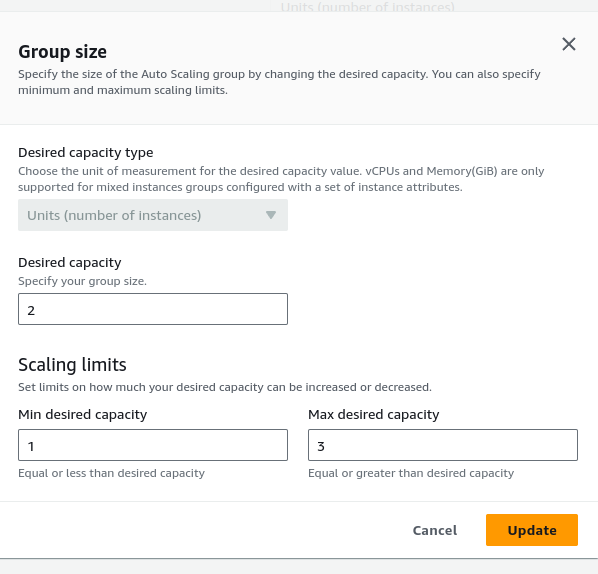
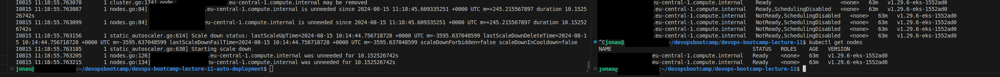

# devops-bootcamp-lecture-11-auto-deployment

# Automated deployment
build jenkins container with respective [Dockerfile.jenkins](Dockerfile.jenkins) (including installation of aws cli)
``` bash
docker build -t jenkins:2.467-jdk21-gradle4.4.1-kubectl-docker-helm-aws . -f Dockerfile.jenkins
```

create [jenkinsfile](jenkinsfile) and store Credentials for docker login in the credentials store for jenkins

Start jenkins controller with respective mount (where the aws credentials reside)
``` bash
docker run -d -v jenkins_home:/var/jenkins_home -p 8080:8080 -p 50000:50000 -v /var/run/docker.sock:/var/run/docker.sock  --restart=on-failure --privileged --name jenkins-controller6 jenkins:2.467-jdk21-gradle4.4.1-kubectl-docker-helm-aws
```

exec into container and run the following:
``` bash
export AWS_SHARED_CREDENTIALS_FILE=/jenkins_home/.aws/credentials 
export AWS_CONFIG_FILE=/jenkins_home/.aws/config
```

adjust [jenkinsfile](jenkinsfile) so that docker is logging into new ecr registry (adding following lines)

``` groovy
        AWS_ACCESS_KEY_ID = credentials('AWS_ACCESS_KEY')
        AWS_SECRET_ACCESS_KEY = credentials('AWS_SECRET_ACCESS_KEY')
        AWS_DEFAULT_REGION="eu-central-1"
```

``` bash
aws ecr get-login-password --region us-east-1 | docker login --username AWS --password-stdin <<MYECR>>.dkr.ecr.us-east-1.amazonaws.com
```
to the new [jenkinsfile_ecr](jenkinsfile_ecr).


# Autoscaling
To enable Autoscaling we will need
* Autoscaling Group on the nodegroup definition 
* a Custom Policy <br> <br>
 <br>
([Image](image-1.png))
<br> <br>and attach that to the node group IAM Role
<br>  <br>
([Image](image-2.png))
<br> <br>
* the Autoscaler operator up and running.
    * The autoscaler needs to auto detect the respective autoscaling group
    * for this we use the Tags on the autoscaling group
        ```
        k8s.io/cluster-autoscaler/eks-cluster-jk
        k8s.io/cluster-autoscaler/enabled
        ```
    * Within the autoscaler yaml (which we retrieve from here: (https://raw.githubusercontent.com/kubernetes/autoscaler/master/cluster-autoscaler/cloudprovider/aws/examples/cluster-autoscaler-autodiscover.yaml)) we now have to adjust a couple of lines:
        add the annotation in the deployment:
        ```
        cluster-autscaler.kubernetes.io/safe-to-evict: "false"
        ```

        adjust image version so that it matches the k8s version of the eks cluster
        ```
        image: registry.k8s.io/autoscaling/cluster-autoscaler:v1.29.2 
        ```

        add and adjust some command parameters as follows:
        ```
        - --node-group-auto-discovery=asg:tag=k8s.io/cluster-autoscaler/enabled,k8s.io/cluster-autoscaler/eks-cluster-jk
        - --balance-similar-node-groups
        - --skip-nodes-with-system-pods=false
        ```

    * Apply all autoscaler resources via
    ``` bash
        kubectl apply -f autoscaler.yaml
    ```

No all is left is configure the desired capacity:
* 

Once this is done the logs show that the autoscaler is scaling the node down.



